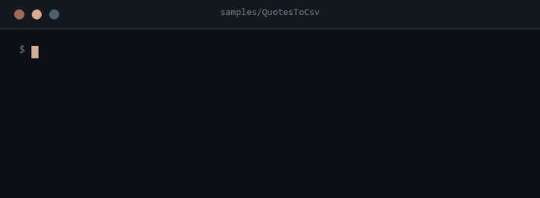

# CrawlSage

> An F#-first web crawling & scraping framework for .NET.

[](https://github.com/gnrkr789/CrawlSage/actions/workflows/ci.yml)
[](https://gnrkr789.github.io/CrawlSage/)
[](https://www.nuget.org/packages/CrawlSage/)
[](LICENSE)




---

## What it is

CrawlSage is a web crawling and scraping framework designed around F# idioms — records and
discriminated unions for data, `option` over null, and `|>` pipelines for behaviour. It pairs
a full crawl engine (request queue, dedup, scheduler, item pipelines) with a resilient
downloader, a concise HTML selector DSL, and first-class politeness.

Two principles shape it:

- **Don't render — extract.** Most "dynamic" pages ship their data as embedded JSON.
  CrawlSage lifts that state directly, so the core needs no browser.
- **Polite by default.** `robots.txt`, per-host pacing, retries and back-off are built into
  the engine, not bolted on.

## Features

- **Resilient downloader** — retry with back-off + jitter, per-request timeout, concurrency
  throttling, gzip/brotli decompression, and correct text encoding (honours a page's `<meta>`
  charset, so EUC-KR / Shift_JIS / GBK pages don't turn into mojibake) — composed as wrappers
  around one `HttpClient`.
- **Parsing & links** — forgiving, `option`-returning CSS *and XPath* selectors, plus a link
  extractor and URL canonicalisation for dedup and same-host filtering.
- **Spider engine** — a frontier-driven scheduler with dedup, depth bounding, an item pipeline,
  per-page fault tolerance, and a `CrawlEvent` hook for stats / logging.
- **Resumable & bounded crawls** — swap the frontier for a disk-backed one (resume after a stop
  or crash) or a memory-capped one, with zero engine changes.
- **Dynamic data, no browser** — pull `__NEXT_DATA__`, JSON-LD and object/array globals out of
  the page, or replay the JSON API; an opt-in `CrawlSage.Browser` (Playwright) adapter renders
  the rest.
- **Politeness & rotation** — `robots.txt` (per-host cache + `Crawl-delay`), per-host pacing,
  honest User-Agent / proxy rotation, and `sitemap.xml` discovery.
- **SSRF guard (opt-in)** — `Safety.publicOnly` refuses links that resolve to loopback, private
  or link-local addresses (incl. cloud-metadata `169.254.169.254`), so crawling an untrusted link
  graph can't be steered into your internal network.
- **Sessions** — a cookie-jar session for form login, saved and restored across runs.
- **Output** — JSON / JSON Lines / CSV / data-frame sinks for items, plus binary file downloads.
- **Declarative & host-ready** — describe a crawl with the `spider { }` computation expression,
  and embed CrawlSage in a .NET host via the opt-in `CrawlSage.Extensions` package
  (`Microsoft.Extensions.Logging` + dependency injection, `IHttpClientFactory`-backed).

---

## Status

**v0.1.2 — beta.** Feature-complete for everyday crawling: resilient downloader, parsing DSL,
spider engine, embedded-JSON extraction, export sinks, politeness, sessions, sitemaps, and an
opt-in browser renderer. Targets **.NET 8** and **.NET 10**.

---

## Install

```bash
dotnet add package CrawlSage
```

Targets **.NET 8** and **.NET 10**. For pages that truly render client-side, add the opt-in
[`CrawlSage.Browser`](https://www.nuget.org/packages/CrawlSage.Browser/) (Playwright) package; to
host CrawlSage in a .NET app (logging + DI), add
[`CrawlSage.Extensions`](https://www.nuget.org/packages/CrawlSage.Extensions/).

---

## Quick start

```bash
# Build from source with the .NET 10 SDK (the package itself targets net8.0 and net10.0)
dotnet build CrawlSage.slnx
dotnet test  CrawlSage.slnx
```

A minimal fetch:

```fsharp
open CrawlSage

let body =
    Request.create "https://example.com"
    |> Request.withHeader "Accept-Language" "en"
    |> Http.fetch
    |> Async.RunSynchronously

printfn "%d — %d bytes" body.StatusCode body.Body.Length
```

Pull a list of fields with the selector DSL:

```fsharp
open CrawlSage

let authors =
    Http.getString "https://quotes.toscrape.com/"
    |> Async.RunSynchronously
    |> Html.parse
    |> Html.selectAll ".quote .author"
    |> List.map Html.text
```

Or describe a whole crawl declaratively with the `spider { }` builder:

```fsharp
open CrawlSage

let crawler =
    spider {
        seed "https://quotes.toscrape.com/"
        parse parseQuotes
        pipeline (Export.appendJsonLine "data/quotes.jsonl")
        maxDepth 3
    }

Spider.crawl crawler |> Async.RunSynchronously
```

Full crawlers — extract a list, follow pagination, lift embedded JSON, rotate User-Agents —
are runnable under [`samples/`](samples), each polite by default.

**Detailed usage:** the [**Guide**](https://gnrkr789.github.io/CrawlSage/guide.html) documents
the full API, module by module — `Http`, `Html`, `Extract`, `Spider`, `Session`, `Frontier`,
and the rest.

---

## Project layout

```
CrawlSage/
├── src/CrawlSage/            # the framework library (browser-free core)
│   ├── Types.fs              #   Request / Response / Renderer / Sink
│   ├── Url.fs                #   resolve · canonicalise · same-host
│   ├── Http.fs               #   the downloader (shared HttpClient, gzip, bytes/download)
│   ├── Resilience.fs         #   retry · back-off · timeout · throttle
│   ├── Rotation.fs           #   honest UA & proxy rotation
│   ├── Session.fs            #   cookie-jar session (login, save/load)
│   ├── Html.fs               #   CSS selector DSL + link extraction
│   ├── Extract.fs            #   embedded-state / JSON extraction (no browser)
│   ├── Robots.fs             #   robots.txt parse · per-host cache · per-host pacing
│   ├── Sitemap.fs            #   sitemap.xml / sitemapindex discovery
│   ├── Frontier.fs           #   in-memory · bounded · persistent (resumable) frontier
│   ├── Spider.fs             #   crawl engine (frontier · dedup · depth · pipeline · stats)
│   ├── SpiderBuilder.fs      #   the spider { } computation expression
│   └── Export.fs             #   sinks: JSON / JSONL / CSV / data frames + saveBytes
├── src/CrawlSage.Browser/    # opt-in JS renderer (Playwright) — not a core dependency
├── src/CrawlSage.Extensions/ # opt-in Microsoft.Extensions logging + DI integration
├── tests/                    # xUnit test projects (core · browser · extensions)
├── samples/                  # runnable, self-contained crawlers
└── docs/                     # documentation site
```

---

## License

[MIT](LICENSE).

**Please crawl responsibly.** Respect `robots.txt`, rate limits, a site's Terms of Service,
and applicable law. CrawlSage is a tool; how you use it is your responsibility.
