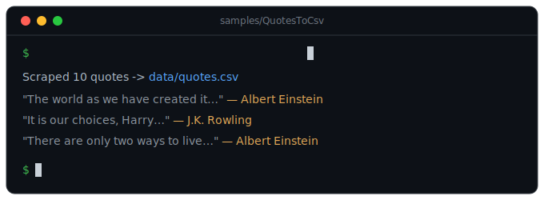

# CrawlSage

**An F#-first web crawling & scraping framework for .NET.**

[Getting started](getting-started.html){: .btn } &nbsp;
[Guide](guide.html){: .btn } &nbsp;
[Architecture](architecture.html){: .btn } &nbsp;
[Cookbook](cookbook.html){: .btn } &nbsp;
[GitHub](https://github.com/gnrkr789/CrawlSage){: .btn }



---

## Why CrawlSage?

CrawlSage gives F# a complete crawling stack: a crawl engine (request queue, dedup,
scheduler, item pipelines) over a resilient downloader, a concise HTML selector DSL,
browser-free extraction of embedded data, and polite-by-default crawl ops.

The API is F#-idiomatic — records, discriminated unions, pipelines and computation
expressions instead of attributes and inheritance.

## Status

🚧 **Early development.** A buildable core ships today (`Request`, `Response`,
`Http.fetch`); the engine, parsing DSL, extraction and cookbook are built out phase by phase.

## A taste

```fsharp
open CrawlSage

let body =
    Request.create "https://example.com"
    |> Request.withHeader "Accept-Language" "en"
    |> Http.fetch
    |> Async.RunSynchronously

printfn "%d — %d bytes" body.StatusCode body.Body.Length
```
